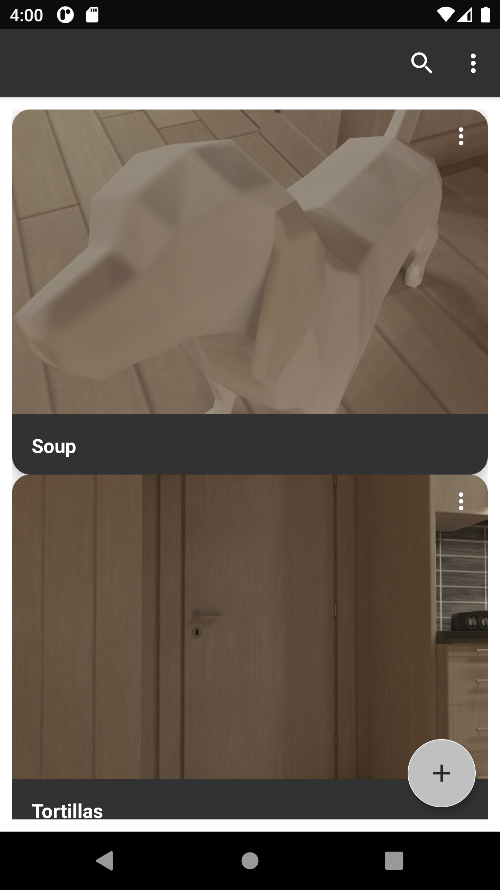
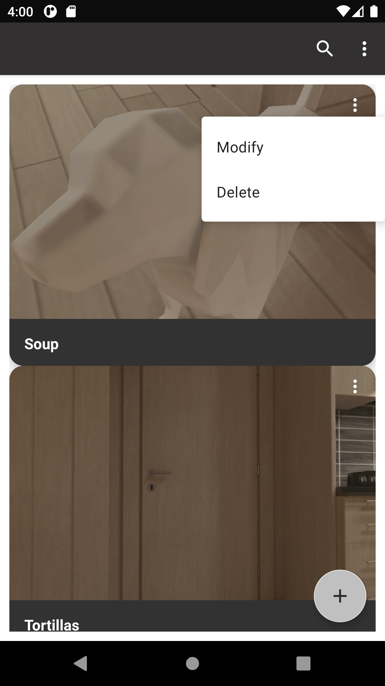
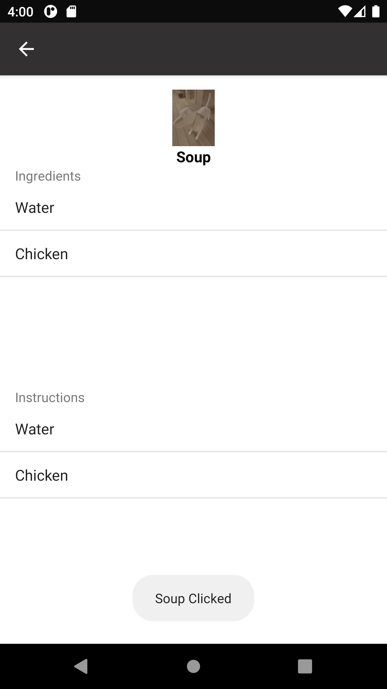
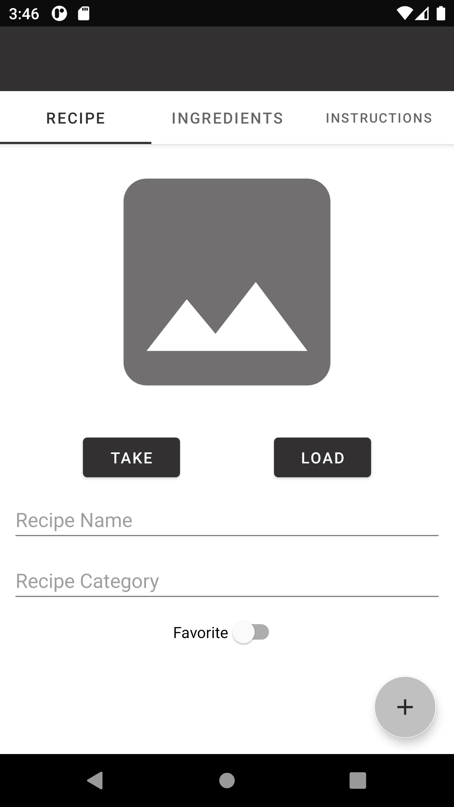
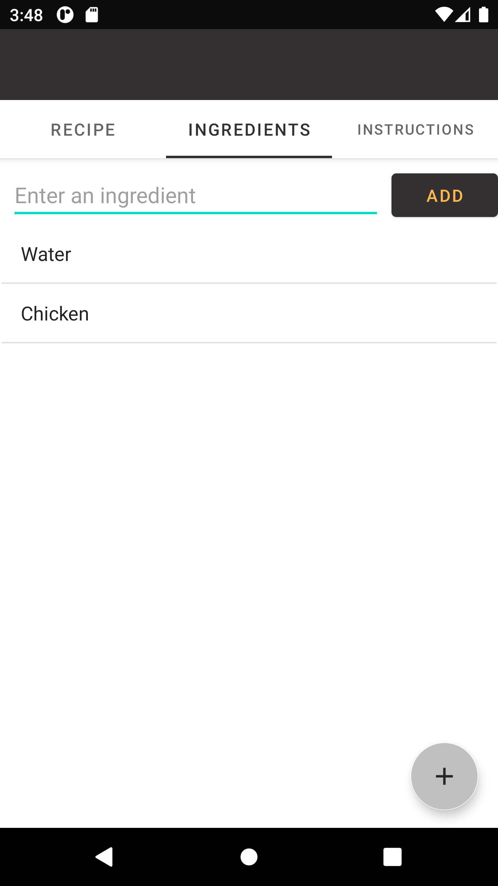
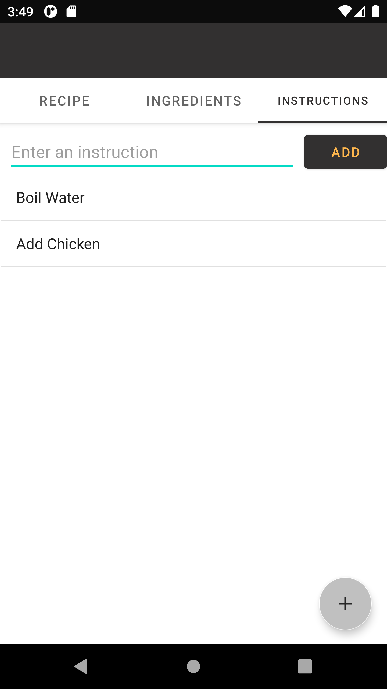

# Recipe App - Java & Android programming class project
Recipe App is a simple Android application for cooking recipes. Users can create, delete 
and add pictures to recipes, which are stored in a SQLite database.

[Javadoc](https://users.metropolia.fi/~matiasdn/javadoc/com/example/androidproject/package-summary.html)

---
## Images
|  |
|:---:|
| Main screen |

|  |
|:---:|
| Vertical ellipsis icon opens a menu for editing and deleting a recipe |

|  |
|:---:|
| Viewing recipe |

|  |
|:---:|
| Adding new recipe |

|  |
|:---:|
| Adding ingredients |

|  |
|:---:|
| Adding instructions |